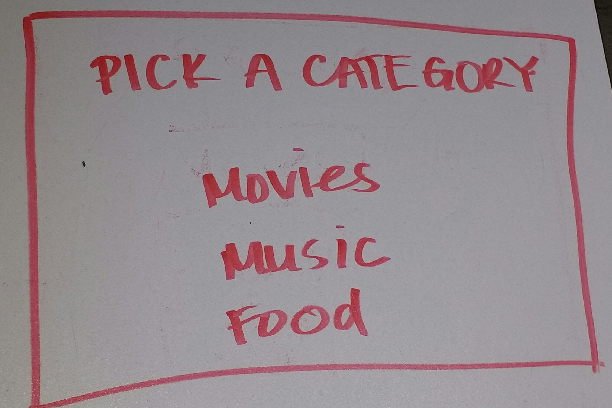
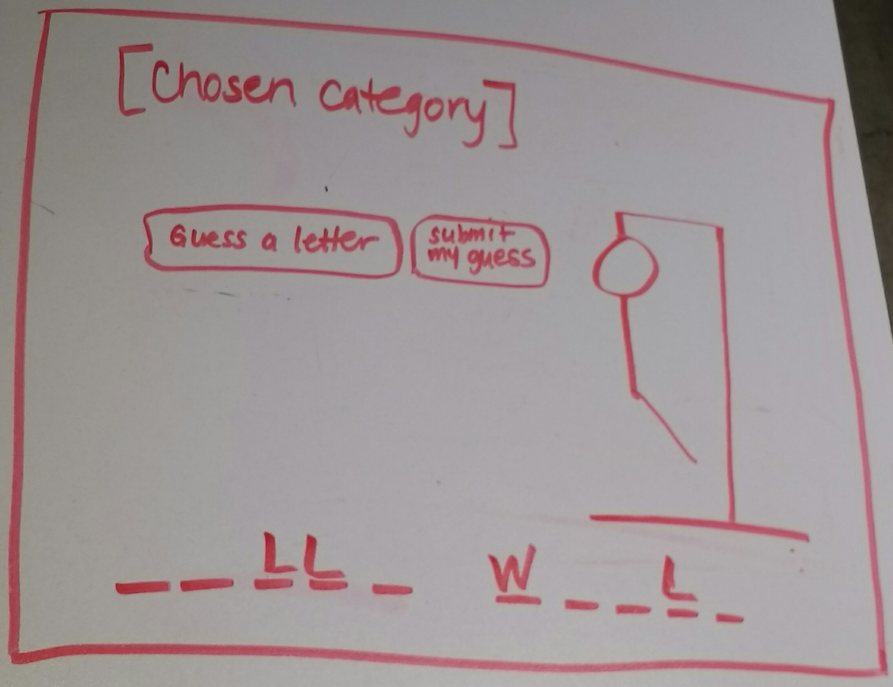
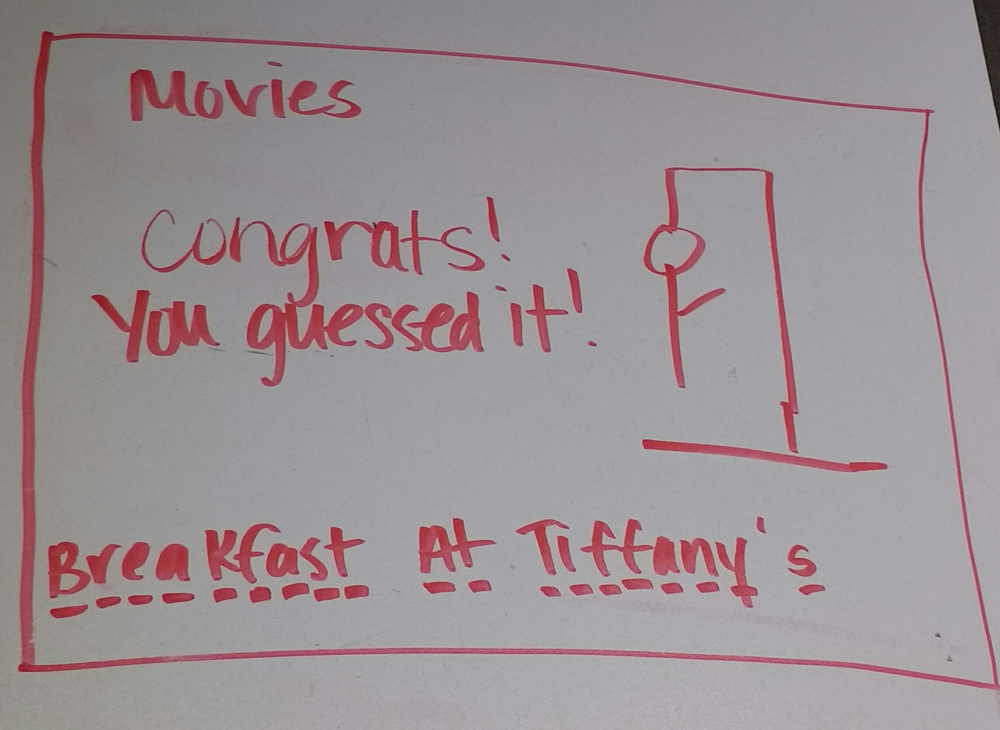
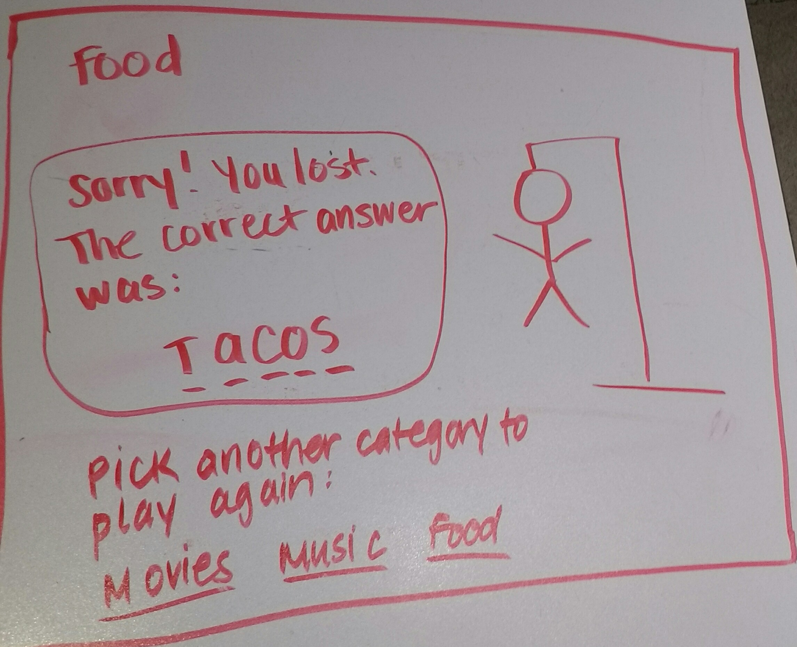

#Hangman

####Intro
For this game, the user will be able to choose from a series of topics such as movies, music, food, etc. These topics will serve as clues for the phrases that the player is meant to guess. The player must choose one letter a time only--even if he/she already knows what the whole phrase is. If the player does not guess the phrase before the man's body is completely hung, the player loses and will be prompted with a message that will allow him/her to try again and pick from one of the categories.

####A Visual - Wireframes

####Check out the user stories for this game on my [Trello](https://trello.com/b/ot7Xo7QV/wdi-sm-43-project-1)!

####Technologies used:
+ HTML
+ CSS
+ Javascript
+ jQuery

####Approach
I will set up my phrase categories and the design of the page in HTML and use CSS for styling. I will use images for the body of the hangman. For the game logic, such as determining the winner, detecting a loss, I will use Javascript. jQuery will be used for user interaction, such as when a user inputs a guessing letter, when the letter is correct and appears above its dash, and when a user guesses incorrectly and a part of the man's body appears on the screen.

I began by determining the categories and their respective categories along with a function for the computer to randomly select one for the player to guess. From there, I moved onto the functionality for missed guesses and correct guesses, and finally the win/lose logic.

####Stretch Goals
If I manage to accomplish all of my goals, I will attempt the following:

+ Have the player guess the whole phrase, and not just one letter at a time. If the user guesses the whole phrase incorrectly, then the user will automatically lose and the entire man will be hung!
+ Allow the user to determine level off difficulty (easier levels have more body parts, therefore more guesses)

####Unsolved Problems
I originally wanted to grant the player the opportunity of guessing the whole phrase, but did not add that feature. The game also does not have multiple levels of difficulty. With time, I would like to clean up my code so that it is more efficient with callback functions, and therefore more maintainable. I would like to attach a gif or image to every answer so that the player may view it upon winning or losing.

####Installation Instructions
+ Clone the repo from Github 
+ Open the index.html in your browser.

####Direct Link to Game: https://github.com/rubisc/WDI_Project1_Hangman
